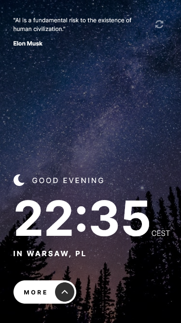
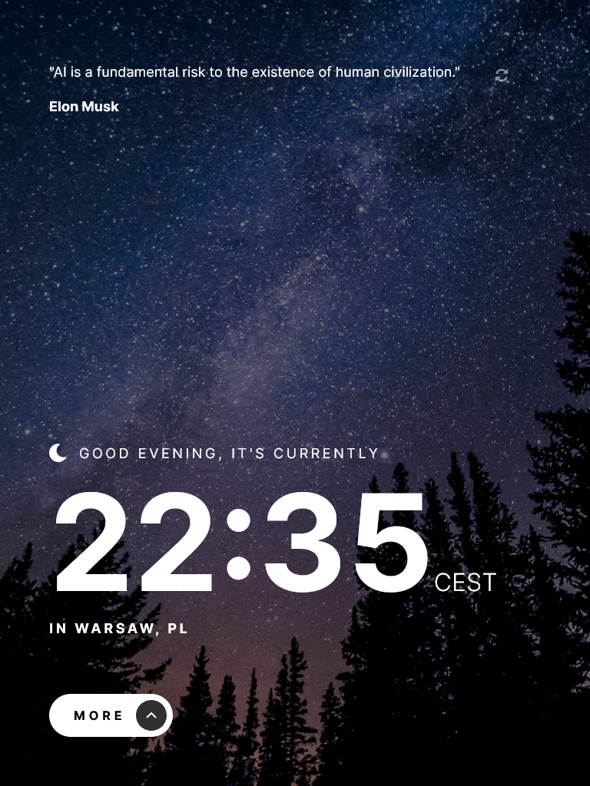
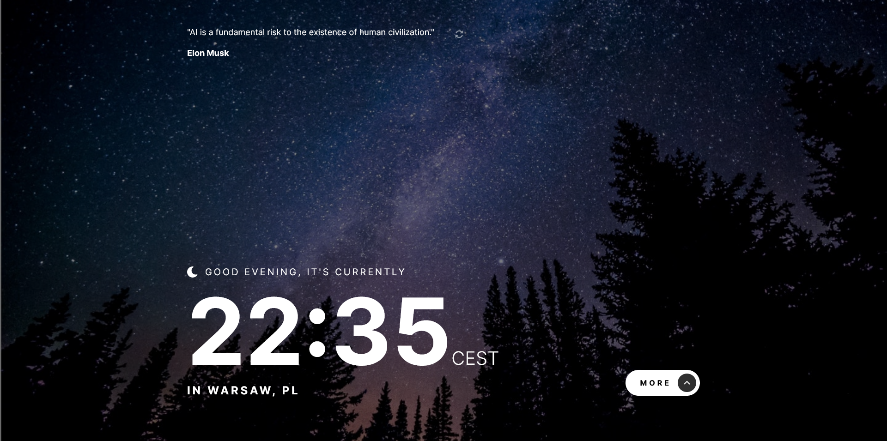
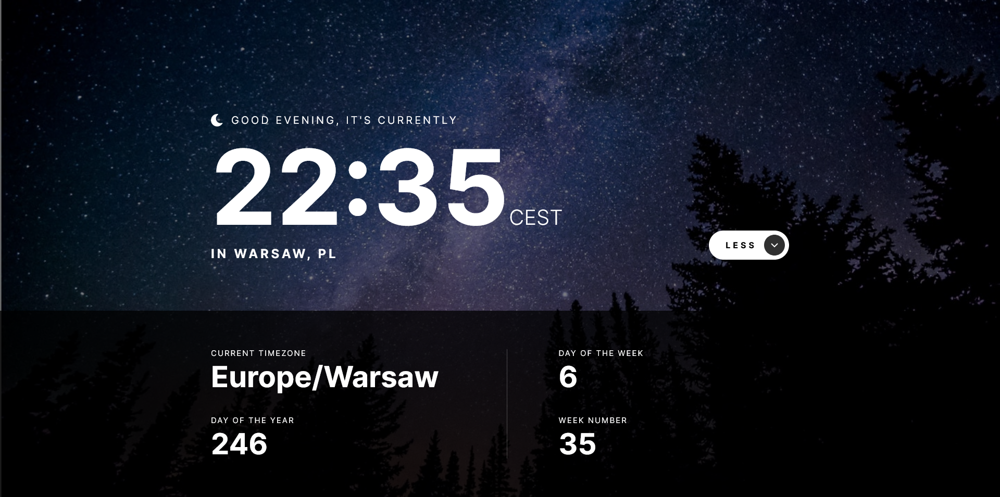

# Frontend Mentor - Clock app solution

This is a solution to the [Clock app challenge on Frontend Mentor](https://www.frontendmentor.io/challenges/clock-app-LMFaxFwrM). Frontend Mentor challenges help you improve your coding skills by building realistic projects.

## Links

- Solution URL: [Frontend Mentor Solution Page](https://your-solution-url.com)
- Live Site URL: [GitHub Pages Site](https://your-live-site-url.com)

## Useful resources

- [IP Geolocation API](https://freegeoip.app/)
- [World Time API](http://worldtimeapi.org/)
- [Programming Quotes API](https://programming-quotes-api.herokuapp.com/)
- [Backdrop-filter on MDN](https://developer.mozilla.org/en-US/docs/Web/CSS/backdrop-filter)

## Author

- Frontend Mentor - [@karolbanat](https://www.frontendmentor.io/profile/karolbanat)

## Screenshots

